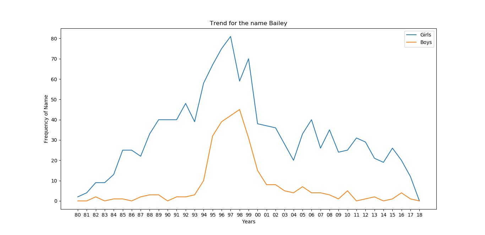

# Alberta-names-analysis
A python command line tool to help analyze Alberta names data.

### Overview
Each year Service Alberta, the provincial department responsible for vital statistics, publishes a list of Alberta’s top baby names. The list of most popular girl and boy names is compiled from the birth information provided by parents and registered  by the department for a particular year.

### How to run:
    
    pip install -r requirements.txt
    python3 albertanames.py
    
   
   
### Sample Output
Command [1]
```
Alberta Baby names
-------------------------------
(0) Quit
(1) Load and process spreadsheet file
(2) Save processed data
(3) Open processed data
(4) Search for a name
(5) Print top ten list for a year
(6) Search for names with specific letters
(7) Graphically display the trend of a name


Enter command: 1
Enter a file name [baby-names-frequency-80-84.xlsx]: Baby_Names_Frequencies.xlsx
Data has been loaded and processed
```
Command [2]: Saves loaded excel data to Pickle file.\
Command [3]: Open the saved excel data from Pickle file.\
Command [4]:
```
Enter command: 4
Enter a name: Charlie

Charlie:
	Boys	Girls
1980 	1	 0
1981 	1	 0
1983 	3	 0
1984 	1	 0
...
2016 	62	 53
2017 	55	 55
2018 	47	 49
```
Command [5]: Top ten baby names for a given year
```
Enter command: 5
Enter year (1980 to 2018): 2018

Top 10 names for baby girls given in Alberta in 2018:
1	Olivia: 235	
2	Emma: 230	
3	Charlotte: 175	
4	Emily: 164	
5	Ava: 161	
6	Abigail: 153	
7	Harper: 150	
8	Sophia: 146	
9	Amelia: 145	
10	Elizabeth: 130	

Top 10 names for baby boys given in Alberta in 2018:
1	Liam: 225	
2	Oliver: 212	
3	Noah: 199	
4	Ethan: 189	
5	Logan: 182	
7	Jacob: 181	
8	William: 178	
9	Benjamin: 176	
10	Jack: 167	
```
Command [6]: Wild card search.\
Search with starting letter: Mich*\
Search with ending letter: *ael\
Search with starting/ending letter: 
```
Enter command: 6
Enter name with * indicating missing letters: z*x

	Boys	Girls
Zaylex
2007:	1	0
2015:	1	0

	Boys	Girls
Zedrhyx
2010:	1	0

	Boys	Girls
Zax
2012:	1	0
2017:	1	0

	Boys	Girls
Zedrix
2013:	1	0
```

Command [7]: 



### Data Source
https://www.alberta.ca/top-baby-names.aspx

